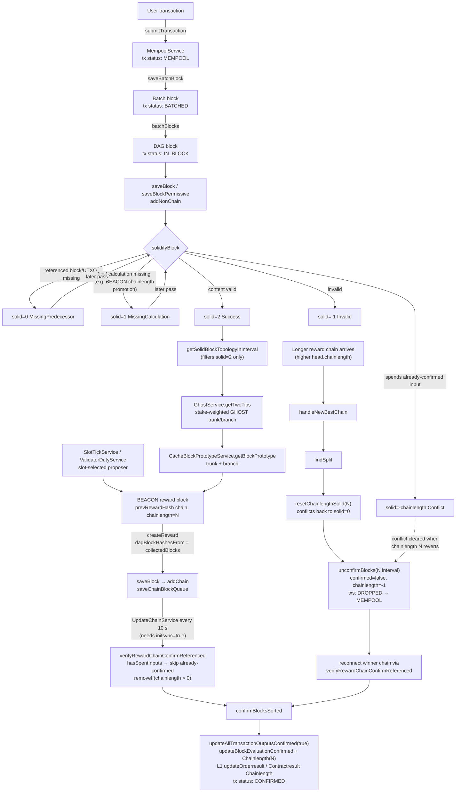

# Technical Design

## Confirmation

Confirmation is handled **by the beacon/reward chain**, not by the block save path. When a block is saved via `saveBlock` or `saveBlockPermissive`, UTXOs are created with `confirmed=false`. Processing a reward block that references the block calls `updateAllTransactionOutputsConfirmed(true)` to mark them spendable.

### Key principle

`calculateAllSpendCandidates` filters on `confirmed=true`. Unconfirmed UTXOs are invisible to wallet operations until a reward block that references the block confirms its outputs.

### Code

```java
// ServiceBaseConnect.connectUTXOs — creates UTXOs with confirmed=false
UTXO newOut = new UTXO(..., false, false, false, ...);
//                           ^spent ^confirmed ^spendPending

// Only confirmed=true UTXOs are spendable
// OutputService.java
if (output.isSpent() || !output.isConfirmed())
    continue;

// The reward chain confirms them
// ServiceBaseConfirmation.confirmBlockTransactionWithType
blockStore.updateAllTransactionOutputsConfirmed(block.getBlock().getHash(), confirmation);
```

### Confirm side effects

`confirmBlocksSorted` (called by `verifyRewardChainConfirmReferenced`) does more than flip UTXO `confirmed` flags. Per block it also:
- `updateBlockEvaluationConfirmed(hash, true)` — marks the block row confirmed
- `updateBlockEvaluationChainlength(hash, N)` — records the reward chainlength N that confirmed it
- L1 order/contract results update their `rewardchainlength` column (`updateOrderresultChainlength` / `updateContractresultChainlength`)

### Unconfirm (reorg)

Rolling back a loser chain (`handleNewBestChain`, see *Best chain* below) reverses all of the above:
- `updateAllTransactionOutputsConfirmed(hash, false)` + `confirmTransactionSpent(false)` — outputs return to `confirmed=false` and spent flags revert
- the chainlength marker is set to `chainlength=-1` (unconfirm passes `-1`; re-confirmation sets the new chainlength)
- blocks that `updateChainlengthConflicts` had marked as `solid=-chainlength` are reset toward `solid=0` via `resetChainlengthSolid`

## Chainlength = Reward Chain Length

Reward blocks form a chain where each points to the previous via `prevRewardHash`. The `chainlength` field equals the reward chain length. Block N in the reward chain has chainlength N.

### Implications

1. **hasSpentInputs with checkChainlength=true**: If a block was already confirmed by chainlength N, it cannot be referenced by chainlength N+1. The verification removes already-confirmed blocks rather than throwing.

2. **Reward blocks are created faster than UpdateChain processes them**. The queue builds up; each reward block references only unprocessed blocks. Already-confirmed blocks are skipped.

### Code

```java
// Reward block creation — chainlength = chain length
// ServiceVerifyReward.verifyRewardChainConfirmReferenced
long chainlength = store.getRewardChainLength(newChainlengthBlock.getHash());

// Conflict check — skip already-confirmed blocks
// ServiceVerifyReward.verifyRewardChainConfirmReferenced
if (hasSpentInputs(allApprovedNewBlocks, true, store)) {
    allApprovedNewBlocks.removeIf(bw -> bw.getBlockEvaluation().getChainlength() > 0);
    if (allApprovedNewBlocks.size() <= 1) return; // nothing new to confirm
}
```

## Solid state machine

`BlockEvaluation.solid` encodes the persistence state of a block (`SolidityState.java`):

| solid | State | Meaning |
|---|---|---|
| 0 | MissingPredecessor | a referenced block/UTXO is not yet stored |
| 1 | MissingCalculation | block content valid; final calculation still missing (e.g. BEACON chainlength promotion) |
| 2 | Success | fully solid |
| -1 | Invalid | rejected |
| -N | Conflict | conflicts with the block confirmed by chainlength N (`solid=-chainlength`) |

Set in `ServiceBase.solidifyBlock`:
- `MissingPredecessor` → `solid=0`
- `MissingCalculation` → `solid=1` (type-specific data is still connected)
- `Success` → `solid=2`; a BEACON block with `setChainlengthSuccess=false` is instead initialized as `solid=1` (missing-calc) so a later pass can promote it
- `Invalid` → `solid=-1`
- conflict: `updateChainlengthConflicts` sets `solid=-chainlength` for a block that spends something a confirmed chainlength block already spent

Only `solid=2` blocks are visible to the topology/tip-selection queries (`getSolidBlockTopologyInInterval` filters `solid=2`) and eligible for confirmation. Blocks with `solid<0` (conflict) stay out of the DAG approval process until the conflicting chainlength is reverted.

## saveBlockPermissive

Used by `MultiSignServiceCreate.signTokenAndSaveBlock` for token creation blocks. The block has already passed `checkFullTokenSolidity` but strict predecessor validation in `addBlock` would reject it (the prototype block's predecessors may not be fully stored).

### What it does

1. `addNonChain(block, true, store, true, true)` — stores block with lenient validation (allows unsolid, allows missing predecessors, batch mode)
2. Sets `solid=2`, `weight=1`, `depth=1` — required because the topology query filters on `solid=2`, and weight/depth make the block a valid tip candidate
3. `accumulateBlockFees` + `broadcastBlock`

### What it does NOT do

- **No immediate UTXO confirmation** — the reward chain handles this via reward blocks
- **No prototype/tips insertion** — the block prototype is built by `CacheBlockPrototypeService` from the GHOST tip selection
- **No connectTypeSpecificUTXOs** — handled by the reward-chain solidify path

### Why solid=2 and weight/depth are needed

```java
// DatabaseFullBlockStoreBase.java
final String SELECT_SOLID_BLOCK_TOPOLOGY_INTERVAL_SQL =
    "SELECT ... FROM blocks WHERE height > ? AND height <= ? AND solid = 2";
```

Without `solid=2`, the topology query cannot find the block. Without `weight=1`/`depth=1`, the block has no weight and won't be selected as a tip by the GHOST two-tip selection.

## Slot tick, tip selection and block prototype

In PoS mode the consensus services live in `bigtangle-servercore`:

1. **Slot tick** — `SlotService`/`SlotTickService` advance at each slot and
   `CasperService` applies attestations/checkpoints at epoch boundaries.
2. **Tip selection** — `GhostService.getTwoTips(store)` picks the trunk and
   branch by stake-weighted GHOST from the solid blocks in the topology query.
3. **Block prototype** — `CacheBlockPrototypeService.getBlockPrototype(store)`
   builds a new block over `Block.createBlock(networkParameters, trunk, branch)`.
4. **RewardService.createReward** — creates a BEACON reward block with
   `collectedBlocks` from `dagBlockHashesFrom`.

Beacon/reward blocks are produced by `ValidatorDutyService.performDuty()` for
the slot-selected proposer and confirmed by `ServiceVerifyReward`/Casper FFG.

## UpdateChainService

Scheduled service in `bigtangle-servercore` that runs every 10 seconds (when `initsync=true`):

```java
@Scheduled(fixedDelayString = "10000")
public void updateChain() {
    if (scheduleConfiguration.isChainlength_active() && serverConfiguration.checkService()) {
        blockGraph.updateChain();
    }
}
```

### Process

1. `updateChainConnected()` — acquires lock, calls `processChainConnected`
2. `processChainConnected()` — iterates `ChainBlockQueue`, calls `saveChainConnected` for each
3. `saveChainConnected()` — deserializes block, calls `solidifyBlocks`, `checkChainSolidity`, `connectRewardBlock`
4. `connectRewardBlock()` — calls `verifyRewardChainConfirmReferenced`
5. `verifyRewardChainConfirmReferenced()` — validates referenced blocks, calls `confirmBlocksSorted`

### Importance of `initsync=true`

The `ScheduleInitService.syncService()` runs at startup with `@Scheduled(initialDelay = 5000, fixedDelay = Long.MAX_VALUE)`. It checks `isInitSync()` which defaults to `false`. Without `initsync=true`:
- `AbstractScheduleInitService.initializeService()` never runs
- `serviceReady` stays `false` (default)
- `UpdateChainService.updateChain()` checks `serverConfiguration.checkService()` which returns `false`
- Reward blocks queue up but are never processed
- UTXOs are never confirmed

## Best chain and reorganization

The beacon/reward chain is produced by a **proof-of-stake** validator set. `SlotTickService` ticks every slot and calls `ValidatorDutyService.performDuty()`, which selects the block proposer by stake (`SlotService.selectProposer` over `getActiveStakeDeposits`), proposes the beacon block, and attests. There is no proof of work on the reward chain.

Fork choice is by reward-chain **length**, not accumulated work. `handleNewBestChain` (`ServiceVerifyReward`) runs when a reward block connects to a fork whose `RewardInfo.chainlength` (reward-chain height) exceeds the max-confirmed-reward head — `BlockStoreService.connectRewardBlock` checks `chainlength > head.chainlength` (`BlockStoreService.java:394`); the old PoW `moreWorkThan` check remains only as a commented-out TODO. The reorganization:

1. **`findSplit`** — locate the block where the old and new reward chains diverge.
2. **Roll back the loser chain**: for each old best-chain reward block (ascending height):
   - `resetChainlengthSolid(chainlength)` — blocks confirmed at that chainlength return to `solid=0`
   - `unconfirmBlocks` — unconfirm every block in that chainlength interval (`confirmed=false`, `chainlength=-1`)
3. **Re-connect the winner chain**: walk its blocks in ascending order, re-running `verifyRewardChainConfirmReferenced` for each (re-confirm, re-set chainlength).
4. **Commit** the DB batch once the winner chain length exceeds the old head's (`getChainlength() > old head`), so progress is durable even if a later block fails.

Because the `solid=-chainlength` conflict markers of the old chain are cleared on revert, reorganizations are fully reversible.

## Block Lifecycle

### Workflow graph



```
saveBlockPermissive
  │
  ├─ addNonChain → solidifyBlock → solid=0 (MissingPredecessor)
  │                                  solid=1 (MissingCalculation)
  │                                  solid=2 (Success)
  │                                  solid=-1 (Invalid)
  │                                  solid=-chainlength (conflict)
  │
  ├─ store.updateBlockEvaluationSolid(block.getHash(), 2)
  ├─ store.updateBlockEvaluationWeightAndDepth(...)
  │
  └─ accumulateBlockFees + broadcastBlock
       │
       ▼
  Tip selection (GHOST) + prototype
       │
       ├─ getSolidBlockTopologyInInterval → solid=2 blocks
       ├─ GhostService.getTwoTips → trunk/branch
       ├─ CacheBlockPrototypeService → new tip prototype
       │
       ▼
  RewardService.createReward
       │
       ├─ dagBlockHashesFrom → collectedBlocks
       ├─ createMiningRewardBlock → BEACON block
       └─ saveBlock → addChain → saveChainBlockQueue
            │
            ▼
  UpdateChainService (every 10s)
       │
       ├─ processChainConnected
       ├─ verifyRewardChainConfirmReferenced
       │    ├─ hasSpentInputs → skip confirmed
       │    └─ removeIf(chainlength > 0)
       │
       └─ confirmBlocksSorted
            ├─ updateAllTransactionOutputsConfirmed(true)
            ├─ updateBlockEvaluationConfirmed(hash,true) + updateBlockEvaluationChainlength(hash,N)
            └─ L1: updateOrderresultChainlength / updateContractresultChainlength

  Longer reward chain (higher chainlength) arrives → reorg
       │
       └─ handleNewBestChain
            ├─ findSplit
            ├─ per old reward block
            │    ├─ resetChainlengthSolid(N) → conflicts back to solid=0
            │    └─ unconfirmBlocks(N interval) → confirmed=false, chainlength=-1
             └─ reconnect winner chain via verifyRewardChainConfirmReferenced
```

## Transaction Status Tracking

Every user transaction is tracked through its lifecycle in the `transactionstatus`
table (`TransactionStatus` / `TransactionStatusRecord`), keyed by transaction hash
(latest state wins):

| Status | Meaning |
|---|---|
| `MEMPOOL` | Submitted and pending in `MempoolService`, not yet in a block |
| `BATCHED` | Drained from the mempool into a transient batch block |
| `IN_BLOCK` | Merged into a block of the DAG |
| `CONFIRMED` | Confirmed by a beacon/reward block — chain history, records `chainlength` N |
| `DROPPED` | Block conflicted with the chain or was unconfirmed by a reorg |

Recorded best-effort (never throws, so tracking cannot break consensus):
- `MEMPOOL` — `DispatcherController` `submitTransaction`/`submitTransactions` (wallet submits a tx via HTTP).
- `BATCHED` — `BlockSaveService.saveBatchBlock`.
- `IN_BLOCK` — `BlockSaveService.batchBlocks`.
- `CONFIRMED` — `ServiceBaseConfirmation.confirmBlockTransactionWithType` at chainlength N.
- `DROPPED` — `ServiceVerifyReward.unconfirmBlocks` on reorg (see below).

### Dropped blocks return to the mempool

On a reorg (`ServiceVerifyReward.handleNewBestChain`), blocks that lose the race are
unconfirmed (`confirmed=false`, `chainlength=-1`). `unconfirmBlocks` then:
1. marks every transaction of those blocks `DROPPED`, and
2. re-submits each transaction back into `MempoolService` (re-validation + re-typing
   via `getTransactionType`) with `MEMPOOL` status, so it retries on the winner chain.

Status writes during a reorg reuse the reorg's own store connection to avoid
cross-connection lock contention with the in-flight batch write.

### Query API

- `getTransactionStatus` — `{ "txHash": "<hex>" }` → status, block hash, chainlength,
  address, timestamps (or `UNKNOWN` if never seen).
- `getTransactionsStatusByAddress` — `{ "address": "<base58>" }` → the user's
  transactions with their latest status. The address is derived from the first
  spendable output when the status is recorded.

Example lifecycle for a payment/order: `MEMPOOL` → `BATCHED` → `IN_BLOCK` →
`CONFIRMED` (chainlength N); after a reorg that drops its block:
`DROPPED` → `MEMPOOL` → … → `CONFIRMED` on the winner chain.

## Test Dependencies

### Remote test (`remote.sh` deleted)
- Docker PostgreSQL on port 5432
- `layer0-server` (HTTP, port 8089)
- `l1-order-server` (L1 order API, port 8086)
- All started with `initsync=true`, `chainlength=true`, `blockbatch=true`, `microbatch=true`

### Run tests
```sh
# Unit + PoS consensus + mempool tests (no DB)
bash helper/testall.sh
```

## Post-Quantum Signature Design

BigTangle signs with **ML-DSA-87 (FIPS 204)** from genesis. The **SLH-DSA-SHA2-256s (FIPS 205)** backstop is available as a second, mathematically independent scheme and can be activated at a governance-chosen chain height (*dual* mode, see *Governance* below). The two schemes rest on completely different mathematics, so they do not share the same failure mode.

| | ML-DSA-87 (FIPS 204) | SLH-DSA-SHA2-256s (FIPS 205) |
|---|---|---|
| Math | Lattice (Module-LWE) | Hash-based (SPHINCS+ stateless Merkle) |
| Signature size | ~4.6 KB | ~30 KB |
| Sign speed | ~5 ms | ~1,700 ms (340x slower) |
| Verify speed | ~1 ms | ~2 ms (both fast) |
| Security assumption | Hardness of lattice problems | Security of SHA-2 (most conservative) |
| Risk | Could be broken by future quantum lattice attack | No known structural risk |

### Why dual ("AND", not "OR") — optional backstop

While the dual suite is active, a transaction is authentic only if **both** signatures verify. Breaking the lattice scheme *alone* is not enough, because the hash-based signature still authenticates the data. This protects the chain against a cryptanalytic break of either family of mathematics. Until activation, the chain relies on ML-DSA-87 alone (single-fault) in exchange for a ~7x smaller signature and fast signing.

### Key concepts in code

- **Key bundle** (`KeyBundle`) — a versioned, algorithm-sorted list of public keys. A *dual* key has two entries (`ALG_ML_DSA_87` + `ALG_SLH_DSA_SHA2_256S`); an ML-DSA-only key has one.
- **Signature bundle** (`SignatureBundle`) — a versioned list of signatures, one per algorithm.
- **Key creation**: `PQKey.createNew()` produces an **ML-DSA-only** key (the default); `PQKey.fromSeeds(mlDsaSeed, slhDsaSeed)` (or a 128-hex `fromPrivateKeyHex`) produces a **dual** key.
- **Signing**: `PQKey.sign(input)` signs with every algorithm the key holds; `PQKey.sign(input, includeSlhDsa)` lets the proposer path emit ML-DSA-only while the dual suite is inactive.
- **Verification**: `PQScriptUtils.verifyPQ` (transactions/UTXOs) requires ML-DSA always and SLH-DSA only when the key bundle carries an SLH-DSA entry (per-key-bundle); `verifyProposerSignature(key, sig, hash, requireSlhDsa)` requires SLH-DSA for proposers only while the dual suite is active at the block height.

### When SLH-DSA is required

- `verifyPQ` — **SLH-DSA required only if the key bundle has an SLH-DSA entry**. ML-DSA-only keys are fully valid and produce ML-DSA-only signatures that pass.
- `verifyProposerSignature` — **ML-DSA always; SLH-DSA required only when the dual suite is active at the block height** (`requireSlhDsa`). Below activation, ML-DSA-only proposer keys are accepted; at/after it, an ML-DSA-only proposer key is rejected (no downgrade).

### Where keys are used in production

- **Block proposers/validators** — `ValidatorDutyService` loads its proposer key from a 64-hex ML-DSA-only or 128-hex dual seed (`PQKey.fromPrivateKeyHex`).
- **Genesis / domain-permission root** — `TestParams.genesisPub` and `permissionDomainname` are locked to an **ML-DSA-87 only** key; the genesis coinbase script is built from it.
- Everything else (wallets, payees, token owners) uses ML-DSA-only keys (`PQKey.createNew()`).

### The suite identity

`PQConstants.SUITE_CAT5_DUAL_1 = 1` (dual ML-DSA-87 + SLH-DSA-SHA2-256s, category 5).
`PQConstants.SUITE_ML_DSA_ONLY = 2` (ML-DSA-87 only, category 5).

A dual key's address uses `SUITE_CAT5_DUAL_1`; an ML-DSA-only key's address uses `SUITE_ML_DSA_ONLY` (`PQKey.toAddress`).

## Governance: suite activation by chain height (ML-DSA now, dual later)

`NetworkParameters` holds a **governance activation map** from suite id to the
chain height at which it becomes active (0 = from genesis; absent = never):

```java
/** suiteId -> activation chain height (0 = genesis). Absent = never active. */
protected final Map<Integer, Long> pqSuiteActivation = new HashMap<>();
public long getPqSuiteActivationHeight(int suiteId);
public void setPqSuiteActivationHeight(int suiteId, long height);
public boolean isPqSuiteActive(int suiteId, long height); // inclusive boundary
```

- `SUITE_ML_DSA_ONLY → 0` (active from genesis) on `TestParams` and `MainNetParams`.
- `SUITE_CAT5_DUAL_1` — **absent by default** (never), so the chain runs ML-DSA-87
  only. The dual suite is armed at a chosen chain length via
  `-Dnet.bigtangle.pq.dualActivationHeight=H`, which sets its activation height.
- `Block.verifyProposer()` computes `requireSlhDsa = params.isPqSuiteActive(SUITE_CAT5_DUAL_1, block.height)`
  and passes it to `PQScriptUtils.verifyProposerSignature(..., requireSlhDsa)`.

### The switch (after chain length `H`)

The switch is **one-way and additive**: ML-DSA stays mandatory forever; SLH-DSA is
added. At `height >= H`, dual-key proposers must emit both signatures and
ML-DSA-only proposer keys are rejected. Old ML-DSA-only UTXOs stay valid forever
because transaction verification is per-key-bundle (`verifyPQ`), so no downgrade
path exists. `PQKey.sign(hash, includeSlhDsa)` lets the proposer path emit
ML-DSA-only while the dual suite is inactive, and both once it is active.

### Trade-offs / constraints

- **Security**: shipping without the SLH-DSA backstop on the domain root means single-fault until the dual suite activates. Going single→dual is strictly an upgrade (no downgrade risk).
- **Genesis immutability**: genesis + `permissionDomainname` are fixed at chain launch. This only applies to a **new chain** (or the test net), not an existing one.
- **Cross-platform vectors**: `PQCrossPlatformCompareTest`, `PQACVPVectorsTest`, and genesis-hash tests must stay consistent with the (ML-DSA-only) genesis vectors.
- **Proposer path**: `verifyProposerSignature` is suite-gated, so a dual-seed proposer key (`fromPrivateKeyHex`) must align with the active suite — validators should provision 64-byte (dual-capable) seeds from day one even though only ML-DSA is signed until `H`.

This is a **consensus/security decision**, not a test optimization — it changes what the chain's root-of-trust signs with.

## PQ pubkey encoding: prefixed vs. raw

`PQKey` exposes **two different byte forms** for a public key. Getting them
confused silently breaks signature verification, address derivation, or key
lookups, so every consumer must use the form the producer wrote.

### The two accessors

| Accessor | Bytes | Purpose |
|---|---|---|
| `getPubKey()` / `getPublicKeyBytes()` / `getPublicKeyAsHex()` | `0x05 \|\| KeyBundle.serialize()` — **prefixed** | the canonical on-chain / script-stack identifier |
| `getKeyBundleBytes()` / `getKeyBundle()` | `KeyBundle.serialize()` — **raw**, no prefix | internal key material, tests, benchmarks |

The `0x05` prefix (`PQScriptUtils.PQ_PUBKEY_PREFIX`) distinguishes a PQ pubkey
from legacy EC pubkeys (`0x02/0x03/0x04`) by its first byte, so
`Script.executeCheckSig` dispatches PQ keys to `PQScriptUtils.verifyPQ` instead
of EC verification. It was introduced in `9a943a265` (PQ verification
integration).

Round-trips are symmetric:
- write: `getPublicKeyBytes()` → `[0x05 | bundle]`
- read: `PQScriptUtils.extractKeyBundle(prefixed)` strips byte 0
  (`PQScriptUtils.java:61`); `PQKey.fromPublicOnly(prefixedPubkey)` rebuilds
  the key; `fromPublicOnlyBytes(raw)` is the raw-bundle counterpart.

### Consistency rule

`getPubKey()`/`getPublicKeyBytes()`/`getPublicKeyAsHex()` all return the
**prefixed** form. Any code that persists, hashes, compares, or verifies a
pubkey must use this form on both the writer and the reader. The raw bundle is
only for key material transport (test vectors, `Block.setProposerKeyBundle`,
which is in-memory and not part of consensus).

### Audited consumers (all consistent, prefixed)

- **Scripts**: `ScriptBuilder.createOutputScript(PQKey)` /
  `createInputScriptForPQ(SignatureBundle, PQKey)` push `getPubKey()` onto the
  stack; `Script.executeCheckSig` / `verifyPQ` consume the same prefixed bytes.
- **Addresses / hash160**: `PQKey.getPubKeyHash()` =
  `sha256hash160(getPubKey())`; all `Address.fromHash160(...,
  sha256hash160(key.getPubKey()))` call sites (wallet, stake deposit,
  bridge vault, order beneficiary) use the same prefixed hash. `Script.getPubKeyHash()`
  returns the hash160 already embedded in the scriptPubKey, so the bonded-output
  check in `checkStakeDepositSolidity` (`sha256hash160(declaredPubkey)` vs
  `out.getScriptPubKey().getPubKeyHash()`) matches.
- **Staking**: `StakeService` builds deposit data from `depositKey.getPubKey()`
  (prefixed); `applyStakeBlock` / `checkStakeDepositSolidity` read the same
  bytes back and store them as `StakeRecord.pubkey`. `RandaoService` signs the
  **prefixed** pubkey in the BLS proof of possession and verifies against the
  same prefixed bytes.
- **Proposer / validator**: `ValidatorDutyService.isProposer` compares
  `proposer.getPubkey()` (prefixed, from `StakeRecord`) with
  `validatorKey.getPubKey()`; `SlotService` selection input / mix commits use
  `v.getPubkey()`; beacon validation rebuilds `PQKey.fromPublicOnly(pubkey)`
  (prefixed) then `verifyPQ(signer.getPublicKeyBytes(), ...)`.
- **Orders**: `OrderOpenInfo.beneficiaryPubKey` = `beneficiary.getPubKey()`
  (prefixed); `checkFullOrderOpenSolidity` derives the address with
  `PQKey.fromPublicOnly(...)` (prefixed) and `checkFullOrderOpSolidity` passes
  the stored `OrderRecord.beneficiaryPubKey` straight into `verifyPQ`.
- **Multisig / tokens**: `MultiSignAddress` hex pubkeys are
  `ecKey.getPublicKeyAsHex()` (prefixed); tokenids are `getPublicKeyAsHex()`.
- **Bridge / anchors**: `BridgeService` pubkey→signer maps and `LayerAnchor`
  signer matching key on `HEX.encode(getPublicKeyBytes())`; `AnchorService` and
  both `DispatcherController` validators compare the configured pubkey hex
  against the prefixed hex.
- **Wallet key chains**: `BasicKeyChain` stores/looks up by `getPubKey()`
  (prefixed) and `getPubKeyHash()`; `findKeyFromPubKey` receives prefixed
  bytes from script chunks / wallet keys.

### No raw-bundle hashing / mixing found

There is **no** production call site that hashes `getKeyBundleBytes()` or
`sha256hash160` of the raw bundle — the raw form never reaches addresses,
signatures, or comparisons in consensus code. The only raw-bundle consumers are
tests (`PQKeyCrossPlatformCompareTest`, `SuiteActivationTest`) and the
benchmark key store.

### Caveats

- Config values (e.g. `anchor.pubKeyHex`, `pos.validatorKey`,
  `l1order`/`layer0` `stakeDeposit` pubkeys) are **prefixed hex** of
  `getPublicKeyBytes()`. If a value was generated from the raw bundle it will
  fail the equality checks above.
- When adding new pubkey consumers, prefer `getPublicKeyBytes()` / `getPubKey()`
  (prefixed); reserve `getKeyBundleBytes()` for key-material transport and tests.

## Test-suite performance work

`testall.sh` runs `bigtangle-core` tests (no DB) then `bigtangle-servercore` PoS consensus + mempool tests. Original runtime was ~11:17 with a surefire fork timeout failure (600 s).

### Bottleneck (historical)

CPU profiling (Java Flight Recorder) showed **88-97% of CPU in SLH-DSA signing** (`SLHDSASigner.generateSignature`, ~1.7 s/sign). Every token/domain/fee operation in the tests signed with a dual key (dual genesis/domain root).

### Changes applied

1. **`PQKey.createNew()` is ML-DSA-only by default** — since the chain's root-of-trust (genesis/domain) is now ML-DSA-87 only, `createNew()` always returns an ML-DSA-only key. Dual keys are created explicitly via `fromSeeds` / a 128-hex `fromPrivateKeyHex` and only sign SLH-DSA once the dual suite is active at the block height. The former `-Dnet.bigtangle.pq.mldsaOnlyDefault` test flag is obsolete. Dual-key SLH-DSA coverage is preserved by the dedicated crypto tests and `SuiteActivationTest`.
2. **Signature memoization in `BcPQSignatureProvider`** — ML-DSA and SLH-DSA are deterministic (same key+message ⇒ same signature), so results are cached by `(privateKey, message)`. Bounded Guava caches.
3. **Property-driven argLine** — a hard-coded surefire `<argLine>` previously overrode `-DargLine`; it is now property-driven with an identical default so the JVM flags reach the fork. The PoS-era `helper/testall.sh` passes the JVM flags via `-DargLine` directly.
4. **`testall.sh`** — the obsolete `-Dnet.bigtangle.pq.mldsaOnlyDefault` flag was removed; `DUAL_H=<height>` optionally runs the suite in post-activation mode.
5. **`pom.xml` fork timeout** — `forkedProcessTimeoutInSeconds` raised 600 → 1500 s (the suite legitimately needs ~6-11 min under PQ crypto).
6. **`ValidatorService2Test`** — 12 token-owner keys switched from `wallet.walletKeys().get(0)` (dual genesis) to `PQKey.createNew()` (ML-DSA-only).

### Results

| | Before (dual genesis) | After (ML-DSA-only genesis) |
|---|---|---|
| Full suite | ~11:17, BUILD FAILURE (fork timeout) | ~5:45 total (~4:41 layer0), BUILD SUCCESS |
| TokenTest | ~136 s | ~15 s |
| ValidatorService2Test | ~71 s | ~14 s |
| DoubleSpentAttackTest | — | ~52 s (ATTACK_COUNT=200) |

All layer0 tests + core crypto tests pass. Dual-key SLH-DSA coverage is retained through `PQSignatureProviderTest` / `PQACVPVectorsTest` / `PQCrossPlatformCompatTest` and the height-gated proposer cases in `SuiteActivationTest`.

### Current suite profile

The layer0 suite is now dominated by `DoubleSpentAttackTest`, which submits up to
`ATTACK_COUNT` (default **200**, was 1000) double-spend transactions and
token-creation blocks. The token-creation attack is the single largest cost — each
iteration does an HTTP `submitTransaction` plus a block prototype calculation, and the
cost grows as state accumulates across the suite. Scale it with
`ATTACK_COUNT=1000 bash helper/testall.sh` (or `-Dnet.bigtangle.attackCount=1000`).
At the default 200 the attack test takes ~52 s in-suite (was ~290 s at 1000).

### Resolution of the remaining SLH-DSA cost

The remaining SLH-DSA (~93% of TokenTest CPU) was tied to the **dual genesis/domain-root key**:

- `wallet.feeTransaction` / `wallet.saveToken` — wallet spendable UTXOs are genesis-coinbase-locked (was dual).
- `payBigTo` — the genesis key signs the funding tx, and change outputs stay genesis-locked.
- `pullBlockDoMultiSign(wallet.walletKeys().get(0))` — domain-permission multisig with the genesis key.

An intermediate attempt to fund an ML-DSA-only spend key in `setUp` made no improvement (change outputs still routed back to the genesis key) and was reverted.

The cost was removed at the source by the **suite-activation governance change** (see *Governance* above): the genesis/domain root is now ML-DSA-87 only, so all genesis-coinbase spends and domain multisig operations sign with the fast lattice scheme. The SLH-DSA backstop remains available and is re-armed at a chosen chain height `H` via `-Dnet.bigtangle.pq.dualActivationHeight=H`.

## Bridge: cross-layer peg (L0 ↔ L1)

The bridge module (`bigtangle-bridge`) implements a bidirectional, 1:1 collateral
peg between the permissionless Layer 0 settlement chain and any L1 application
chain. The trust model is deliberately asymmetric:

- **L0 is permissionless** — anyone can lock collateral, run a node, or settle.
- **L1 can be any permission system** — a permissionless PoS chain, a
  permissioned/consortium chain, or a single-operator chain. L0 never inspects
  L1's internals.

Every security-relevant check runs on L0 against **L0's own records** (vaults,
peg-in/peg-out ledger, per-token flows) or against **L0 configuration** (per-chain
anchor signers, freeze list, vault keys). No rule assumes L1's internal honesty or
its permission model.

### The invariant

For every token `T` and every L1 chain `C`:

```
wrapped supply on C(T)  ==  locked L0 collateral on C(T)
```

which decomposes into the rules below. Breaking it would let the round trip mint
or destroy value.

### Peg-in (L0 → L1) — `BridgeService.processPegIn`

A signed transaction spends exactly one L0 UTXO and pays the vault script. Guards:

- exactly one input and one output; the output must pay the configured vault
  script (legacy P2PKH or M-of-N P2SH),
- **1:1 lock**: the output value must equal the input value, same amount **and**
  same token (`Coin.equals`), so a `VaultRecord` can never diverge from the actual
  locked output — a divergent record would strand or under-deliver on peg-out
  (R5 is all-or-nothing),
- **ownership proof**: the input `scriptSig` must correctly spend the source
  UTXO's scriptPubKey, so only the owner can lock it,
- the L1 beneficiary and destination chain id travel in the signed transaction
  data (covered by the input signature), and the vault is keyed on the **source
  outpoint** (`utxoBlockHash : utxoIndex`), making it replay-safe.

### Wrapped issuance (on L1) — `L1CrosstangleHandler`

`processPegInFromL0` polls L0 for the vault key's balances, hash-verifies the
locking block, binds the UTXO to that block's transaction, verifies the lock pays
the vault for the same value, and requires the lock to declare **this** chain as
its L1 destination. Only then does it mint wrapped tokens 1:1.

L1 consensus (`validateIssuance`) authenticates the mint and binds it to its lock:

- the mint must be a **zero-input** transaction carrying a signature by the
  chain's dedicated **issuance key** (never the L0 vault key, R4),
- it must declare this chain's id,
- **lock-backed binding**: the data must declare `lockAmount`, `lockTokenId` and
  `lockBeneficiary`, and the **single** output must match them exactly — amount,
  token id and recipient. A mint can never be oversized, cross-token, or
  redirected away from the lock's beneficiary. This closes the "L1 prints wrapped
  BIG out of thin air" vector at L1 consensus (deterministic on the block data),
- a lock may be issued **once**: `checkPreConfirm` rejects a second issuance of
  the same `chainId:lockBlockHash:lockIndex` from a chain-derived issued-lock
  table, so a replay cannot inflate the wrapped supply.

### Peg-out (L1 → L0) — `BridgeService.processPegOut`

A release happens only when a **confirmed** anchor carries a signature-quorum,
SPV-verified burn. Guards, in order:

- the anchor must be confirmed and embed a well-formed burn (validated by
  `AnchorService.validateAnchor` before the record exists),
- the burn must reference an **unspent** vault for the anchor's chain
  (`findVault` only reads unspent vaults); an already-released vault is skipped,
- **all-or-nothing (R5)**: the burn amount must equal the vault amount exactly —
  a partial burn would strand the remainder (the vault is marked spent, the
  change UTXO would have no unspent `VaultRecord`),
- **no cross-token migration**: the burn token must equal the vault token, so a
  burn in a foreign token can never move the locked collateral,
- **per-token flow invariant**: the release amount may never exceed the sum of
  unspent vaults for `(chain, token)` — cumulative L1→L0 (released) can never
  exceed cumulative L0→L1 (locked). Enforced with `BigInteger` so the sums cannot
  overflow. The per-vault rule already makes each release equal to one lock; this
  is an explicit hard backstop that stays effective if partial/fungible releases
  are ever introduced,
- the release transaction must be signed by the L0 vault key (legacy) or M-of-N
  vault keys (P2SH) via `signVaultRelease`, and the vault is marked spent exactly
  once — a replayed burn cannot release it twice.

### Anchor authentication — `AnchorService.validateAnchor`

- signature **quorum** against the per-chain registry `anchor.chainPubKeys`
  (`M` of `N` distinct authorized signers; per-chain entries override the global
  key), so one compromised global key cannot forge anchors for a chain with its
  own entry,
- **SPV proof** binding the anchored head hash to the committed confirmed root,
- `eventId` must equal `chainId:height`, and the burn must be well-formed
  (positive amount, valid recipient address, non-empty token id, `vaultRef`
  containing `:`),
- **freeze check**: anchors from a chain in `anchor.disabledChains` are rejected
  outright.

### Freeze and recovery (untrusted / broken L1)

Because L1 may be any permission system, the halt control is purely L0-side:

- `anchor.disabledChains` freezes a chain: L0 **rejects all new anchors** from it
  (`validateAnchor`) and **ignores every peg-out burn** from it
  (`processPegOut`), including burns confirmed before the freeze (the retry loop
  keeps re-attempting them).
- While frozen, the vault collateral stays locked on L0. Recovery is done from
  L0's own peg-in records (`VaultRecord.ownerAddress`): the collateral can be
  returned to the **original depositors**, then a fresh L1 is bootstrapped with
  new keys; its wrapped tokens are backed by fresh peg-ins. L0 cannot migrate
  wrapped balances to the new chain (no L1 state on L0), which is why recovery
  targets depositors, not holders.
- The ultimate backstop is **vault custody**: releases require the L0 vault keys
  (M-of-N), so even a forged anchor cannot move collateral without the L0
  keepers co-signing.

### Attack tests

`BridgeServiceTest` and `L1CrosstangleHandlerTest` pin the rules above:

- `testRoundTripConservesValueExactly` — a full lock→release cycle is net-neutral
  (same amount, same token out as in),
- `testPegOutRejectsCrossTokenBurn` / `testFictiveTokenBurnIsHarmlessNoOp` — a
  burn in a foreign or non-existent token releases nothing, and L1 keeps
  functioning,
- `testPegOutReplayCannotDoubleRelease` — a vault is released exactly once,
- `testPegOutRejectsMismatchedBurnAmount` / `testPegOutRejectsPartialBurn` —
  over- and partial burns are rejected (R5),
- `testPerTokenPegOutNeverExceedsPegIn` — for BIG and a custom token, cumulative
  released ≤ cumulative locked at every step,
- `testFrozenChainFreezesPegOut` — a frozen chain's anchors are rejected and its
  previously-confirmed burns are ignored,
- `testRejectsUnbackedWrappedBIGMint` and the `testRejectsIssuanceMismatching*`
  family — L1 consensus rejects unbacked or divergent issuance,
- `testReplayIssuanceRejectedAtConfirmation` — a lock is minted at most once.
